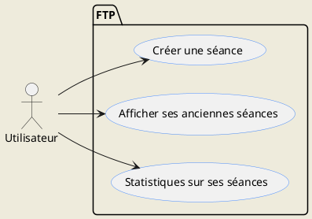
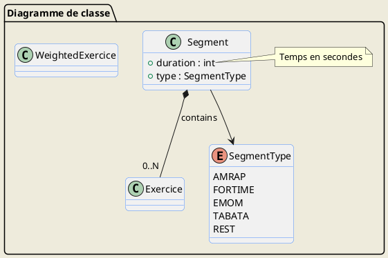

# Diagramme UML de l'application

## Diagramme cas d'utilisation

```plantuml
@startuml
skinparam backgroundColor #EEEBDC
skinparam roundcorner 10
skinparam usecase {
BorderColor #4A8CFC
}
left to right direction
actor Utilisateur as s
package FTP{
  usecase "Créer une séance" as UC1
  usecase "Afficher ses anciennes séances" as UC2
  usecase "Statistiques sur ses séances " as UC3
}
s --> UC1
s --> UC2
s --> UC3
@enduml
```

## Diagramme de classe

```plantuml
@startuml
skinparam backgroundColor #EEEBDC
skinparam roundcorner 10
skinparam class {
BorderColor #4A8CFC
}

package "Diagramme de classe" {

  class Exercice{

  }

  class WeightedExercice{

  }

  enum SegmentType{
    AMRAP
    FORTIME
    EMOM
    TABATA
    REST
  }

  class Segment{
    + duration : int
    + type : SegmentType
  }

' Notes

  note right of Segment::duration
    Temps en secondes
  end note

' Lien entre classes

  Segment --> SegmentType
  Segment *-- "0..N" Exercice : contains

}

@enduml
```
